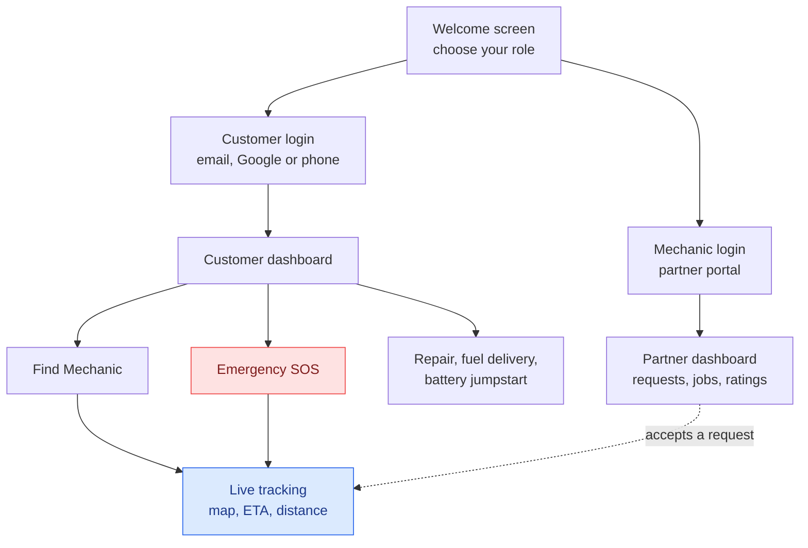
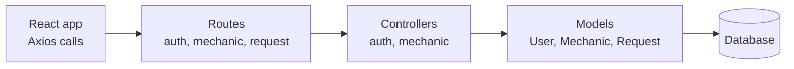

<p align="center">
  
</p>


<p align="center">
  <h2>A roadside assistance platform for the moment the car stops and the phone is all you have</h2>
</p>

<!-- HACKATHON DETAILS: add the hackathon name, date, and your team or result here.
Example: Built at <Hackathon name>, <month year>. Finished <position / award>. -->

<!-- LIVE DEMO: if the app is deployed, add the link here
<p align="center"><a href="https://your-link-here">🌐 Live demo</a></p>
-->

Mechanical Buddy was built during a hackathon. A driver whose vehicle breaks down can find a nearby mechanic, watch them come closer on a live map, and press an SOS button if it's urgent. Mechanics get a separate portal where they take requests and build up a rating. Both sides live in one app, so a request made on one phone shows up on the other.


<div align="center">
  <h2>🚀🧑🏻‍💻 A look at the App</h2>
</div>

### The customer home screen


The home screen opens with two actions front and centre, **Find Mechanic** and **Emergency SOS**, so nothing stands between a stranded driver and help. Next to them is the live tracking card: a map with the mechanic's position and a strip underneath showing ETA, distance and the vehicle number. Below that are the three services on offer, repair, fuel delivery and battery jumpstart. The header shows the user's location as it's being picked up, plus a notification bell.

### Picking a side


The entry screen asks one question: are you a customer or a mechanic? Each role has its own login and its own dashboard behind it, and new users can register from the same card.

### Two portals, one app

<table>
  <tr>
    <td width="50%"></td> 
    <td width="50%"></td>

  </tr>
  <tr>
    <td align="center"><b>Customer portal</b></td>
    <td align="center"><b>Mechanic partner portal</b></td>
  </tr>
</table>

The customer side is built around getting help quickly: nearby mechanic support, round-the-clock emergency assistance, and live tracking with alerts. The mechanic side is built around the work: managing service requests, accepting jobs, and earning ratings, reviews and rewards. Both portals let people sign in with email and password, Google, or a phone number, and both have a remember-this-device option.

## ✨ What's inside

| | |
| --- | --- |
| 🗺️ **Live tracking** | Leaflet map with ETA, distance and vehicle details for the mechanic on the way |
| 🚨 **Emergency SOS** | Sends information & location to nearest police station & mechanics |
| 🔧 **Services** | Repair, fuel delivery and battery jumpstart |
| 👥 **Two roles** | Separate customer and mechanic portals with their own logins |
| 🔐 **Sign in options** | Email, Google or phone |
| 🌐 **Language support** | Built on i18next so the interface can switch languages |
| 🎞️ **Smooth motion** | Page and card transitions with Framer Motion |

🧰 Used technologies
<p align="center">  &nbsp;&nbsp;  &nbsp;&nbsp;  &nbsp;&nbsp;  &nbsp;&nbsp;  &nbsp;&nbsp;  &nbsp;&nbsp;  &nbsp;&nbsp;  &nbsp;&nbsp;  &nbsp;&nbsp;  &nbsp;&nbsp;  &nbsp;&nbsp;  &nbsp;&nbsp;  </p> <p align="center">  </p> <!-- BACKEND: confirm the rest — Mongoose? JWT/auth library? Mongo Express is a dev-only DB admin UI, not part of the running app, so it belongs in a "Development" note below rather than here. -->

<!-- BACKEND: the server/ folder has its own stack. Add its icons and names here.
Example: Node.js, Express, MongoDB -->

## 🧭 How a user moves through it



## 🧩 Under the hood
 
The backend is split the way most Node APIs are: routes receive the request, controllers hold the logic, and models describe the data. There are three models, User, Mechanic and Request, which map to the three things the app is about: people who need help, people who give it, and the service requests between them.
 

 
## 🏆 Hackathon
 
<!-- CERTIFICATE: upload the image to assets/certificate.png, then remove the comment markers around the line below

-->
 
<!-- Add a line or two here about the hackathon, the theme, how long you had, and what your team built in that time. -->
 
## 📁 Project structure
 
```
MechanicalBuddy/
├── assets/                    # banner, logos and screenshots
│   ├── banner.svg
│   └── screenshots/
├── public/
│   ├── sounds/                # notification sounds
│   └── notification.mp3
├── server/
│   ├── controllers/           # authController, mechanicController
│   ├── models/                # User, Mechanic, Request
│   ├── routes/                # authRoutes, mechanicRoutes, requestRoutes
│   └── server.js              # backend entry point
├── src/
│   ├── components/            # Navbar, Hero, Services, LiveTracking, MechanicCard,
│   │                          # CustomerRequestCard, ProfileModal, FooterStats,
│   │                          # MechanicDashboardContent, logo
│   ├── pages/                 # Home, Division, Customer, CustomerReg, Mechanic,
│   │                          # MechanicReg, MechanicHome, MechanicDashboard
│   ├── App.jsx
│   ├── i18n.js                # language setup
│   └── main.jsx
├── index.html
└── vite.config.js
```
 
<p align="center">
  Built during a hackathon by <a href="https://github.com/Bikram-sGit00">Bikram-sGit00</a> 🛠️
</p>

<!-- Add a line or two here about the hackathon, the theme, how long you had, and what your team built in that time. ttps://github.com/Bikram-sGit00">Bikram-sGit00</a> 🛠️
</p>
